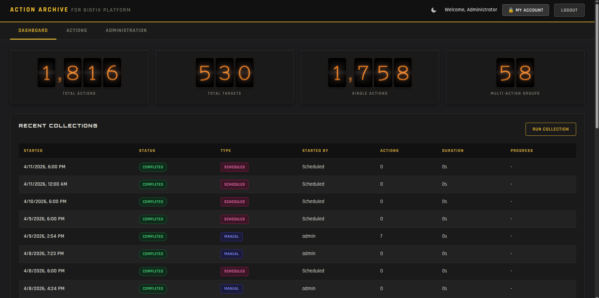
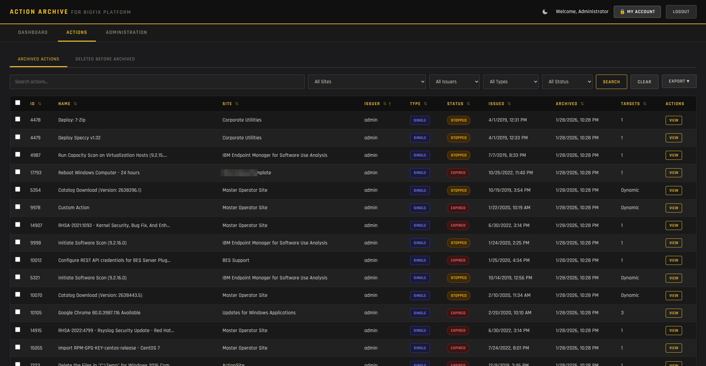
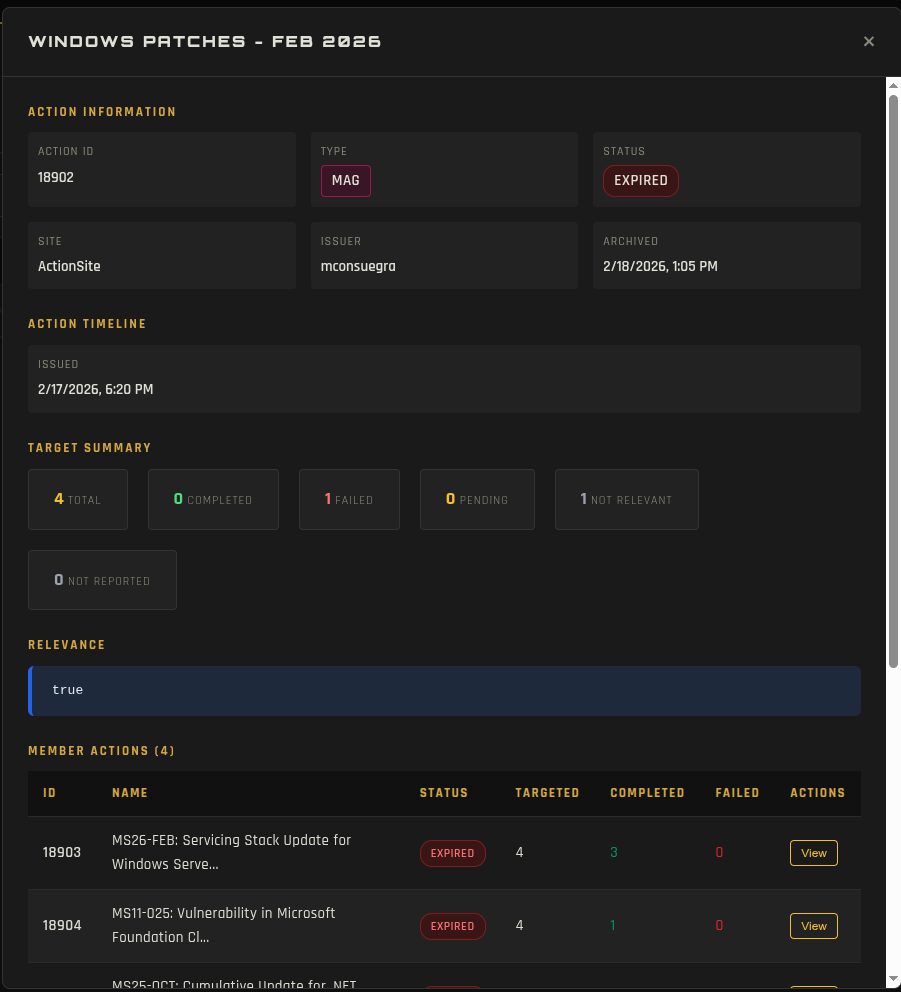
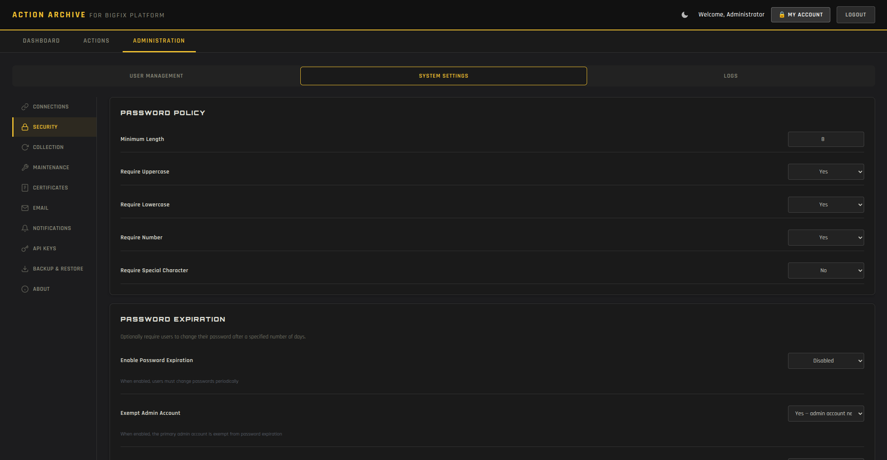
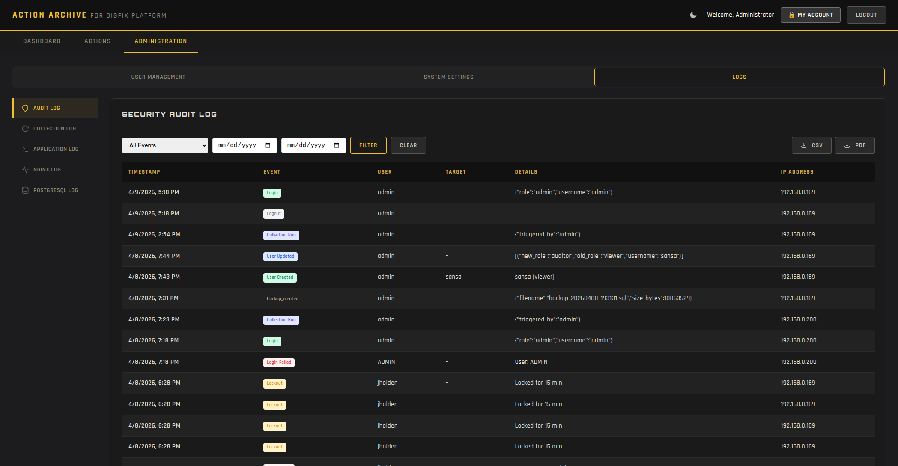
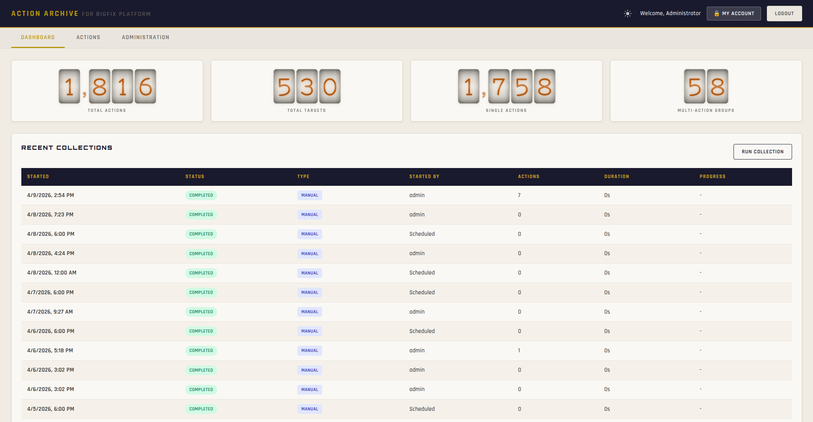
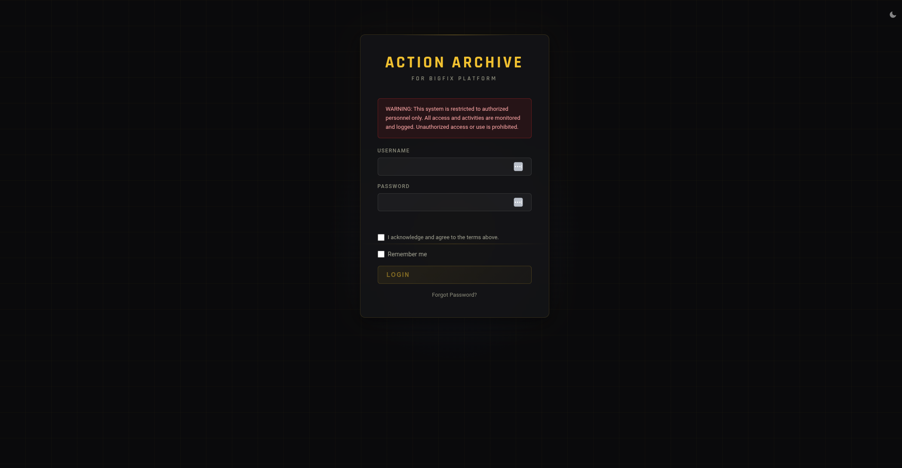

# Action Archive for BigFix Platform


A self-hosted web application that collects, archives, and displays expired and stopped actions from a BigFix endpoint management server. Provides a searchable historical record with full action metadata, target details, scripts, relevance, and compliance reporting.



---

## Why Action Archive

BigFix Root Server accumulates thousands of expired actions over time. As the action history grows, the BigFix console becomes slower and harder to navigate, and historical action data is eventually pruned. **Action Archive** captures every expired or stopped action along with its targets, components, scripts, and relevance into a dedicated PostgreSQL database, giving you a permanent, searchable, exportable record of everything BigFix has ever run in your environment.

It is designed to run alongside your BigFix infrastructure as a self-hosted appliance on a single Ubuntu server. There are no external dependencies, no cloud services, and no telemetry. The application speaks to your BigFix Root Server's REST API, archives what it finds, and presents it through a web interface.

---

## Key Features

- **Automated Collection** — Scheduled archiving of expired and stopped BigFix actions with complete metadata
- **Action Browser** — Search, filter, sort, and export archived actions with full target details
- **Dashboard** — Real-time statistics with counters and collection status
- **Role-Based Access Control** — Multiple roles with configurable scopes
- **Session Management** — Configurable timeouts, idle detection, and concurrent session limits
- **Security Hardening** — Password policies, account lockout, IP rate limiting, login banners, encrypted credential storage
- **Audit Log** — Full audit trail of administrative actions with CSV and PDF export
- **Backup & Restore** — One-click database backup and restore from the web interface
- **Email Notifications** — Per-user notification preferences for security and collection events
- **BigFix Console Cleanup** — Optional automatic deletion of archived actions from the BigFix console
- **Health Monitoring** — System health endpoint with database, BigFix, disk, and memory status
- **API Key Management** — SHA-256 hashed API keys for programmatic access
- **Dark and Light Themes** — Dark and Light theme toggle
- **Windows Audit Agent** — Optional companion agent for endpoint audit data collection

---

## Screenshots

### Dashboard


### Action Browser


### Action Detail
<p align="center">
  
</p>

### Administration


### Audit Log


### Light Theme


### Login


---

## Documentation

Both guides are included as PDFs in this repository and inside the release tarball:

- **[Installation Guide](docs/ActionArchive-Installation-Guide-v1.0.1.pdf)** — Step-by-step installation, prerequisites, BigFix operator setup, SSL certificates, and post-install verification
- **[Administrator Guide](docs/ActionArchive-Admin-Guide-v1.0.1.pdf)** — Day-to-day operations, user management, settings reference, backup and restore, troubleshooting, and security guidance

---

## Quick Start

### Prerequisites
- Ubuntu Server 22.04 LTS or 24.04 LTS (amd64)
- Root or sudo access on the target server
- Network access from the server to your BigFix Root Server's REST API
- A dedicated BigFix **Master Operator** account for the collector
- Minimum 2 GB RAM and 10 GB free disk space

### Install

```bash
# Download the latest release
wget https://github.com/mxc0bbn/action-archive-bigfix/releases/latest/download/action-archive-v1.0.1.tar.gz

# Extract
tar -xzf action-archive-v1.0.1.tar.gz
cd action-archive

# Run the installer
sudo bash install.sh
```

The installer will prompt for the admin account, BigFix connection details, and SSL certificate options. Everything else (PostgreSQL, Nginx, systemd service, sudoers, application user, database schema) is configured automatically. Total install time is typically under five minutes on a clean Ubuntu host.

After installation, browse to `https://<your-server-ip>` and sign in with the admin credentials you provided during install.

For full step-by-step instructions, prerequisites, and troubleshooting, see the **[Installation Guide PDF](docs/ActionArchive-Installation-Guide-v1.0.1.pdf)**.

---

## Architecture

| Layer | Technology |
|---|---|
| Backend | Python 3.12, FastAPI, SQLAlchemy |
| Database | PostgreSQL 16 |
| Frontend | Vanilla HTML, CSS, JavaScript (no framework) |
| Reverse Proxy | Nginx with TLS 1.2+ |
| Application Server | Uvicorn (single worker, bound to localhost) |
| Process Management | systemd |
| Operating System | Ubuntu Server 22.04 / 24.04 LTS |

The application binaries are compiled to native shared libraries (Cython) for performance and to protect against casual modification. The frontend is minified for production. A SHA-256 manifest verifies the integrity of all distributed files at startup.

---

## Security

Action Archive ships with security as a default posture, not an afterthought:

- **Encrypted credential storage**
- **HTTPS by default**
- **Hardened file permissions**
- **Process isolation**
- **Audit logging**

---

## Releases

The latest release is available on the [Releases page](https://github.com/mxc0bbn/action-archive-bigfix/releases). Each release includes:

- **`action-archive-v1.0.1.tar.gz`** — Complete application tarball with installer, source artifacts, and documentation
- **`action-archive-audit-agent-v1.0.0.zip`** — Optional Windows Audit Agent installer
- **`ActionArchive-Installation-Guide-v1.0.1.pdf`** — Installation Guide (also included inside the tarball)
- **`ActionArchive-Admin-Guide-v1.0.1.pdf`** — Administrator Guide (also included inside the tarball)

---

## Compatibility

| Component | Tested With |
|---|---|
| BigFix Platform | Tested against current BigFix Root Server v11.0.5.203/204 REST API |
| Ubuntu Server | 22.04 LTS, 24.04 LTS |
| PostgreSQL | 16 (installed automatically by the installer) |
| Browsers | Chrome, Edge, Firefox |

A dedicated BigFix **Master Operator** account is required for complete action collection. See the Installation Guide for the rationale and setup details.

---

## License

This software is **free to use and freely distributable** in its original, unmodified form. Modification for commercial sale or distribution is not permitted. See the [LICENSE](LICENSE) file for the complete terms.

---

## Support

For questions, bug reports, or feature requests, please open an issue:
[https://github.com/mxc0bbn/action-archive-bigfix/issues](https://github.com/mxc0bbn/action-archive-bigfix/issues)
